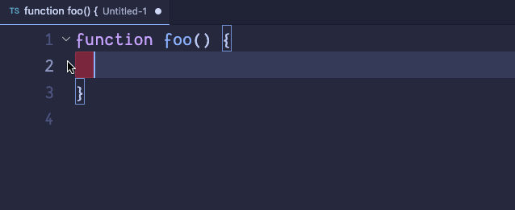

# Take Home VSCode Extension

I have always wanted a simple codemod/refactor that would do the following, turn:

```javascript
return someValue
```

into:

```javascript
const result = someValue
console.log({ result })
return result
```

The number of times I've done this in my career is in the 1000s easily. You could sometimes do this at the function's consumer level, but this is the easiest change often, and being able to do it in one-click, or a keybinding, could be very useful to anyone's debugging workflow.

## Features

If a function returns a value, you'll be able to "quick fix" it into a result logger.



## Requirements

As this isn't published, you need to run it in VSCode's Debugger mode.

## Extension Settings

No settings

## Known Issues

There are some TODOs remaining:

- Tests
- Indentation of generated code could be better

## Challenges

Going into this, I had absolutely zero familiarity with VSCode extensions. A lot of the time was simply getting familiar with what was available to me. Reading example code (official and open source extensions), reading the types (the typedefs were really the simplest way to understand the VSCode API, but their docs had their uses, too).

Later on, I ran into a snag attempting to use `acorn` as my AST parser. I began with what I'm using now, `@typescript-eslint/typescript-estree`, but after coming across `astring` to generate code from the AST, it made me consider using `acorn`. It's still unclear to me what was happening. There was no crash information in the Debug Console, but it would stop working after checking the AST a handful of times. I reverted back to the previous AST package and moved on after a while as I didn't want to waste anymore time, but I would be curious to figure it out someday.

While I don't think a _single_ code refactor is terribly impressive, I'm satisfied with my work. It's a world of difference to be working on something for 3-5 hours in something you're very familiar with versus something you don't know at all. While perhaps I could have created _more_ if I stuck to something I know well, perhaps making some UI in a webview perhaps, I didn't want to shy away from trying something I didn't even _know_ if it could be done. I look forward to discussing the project with you.
